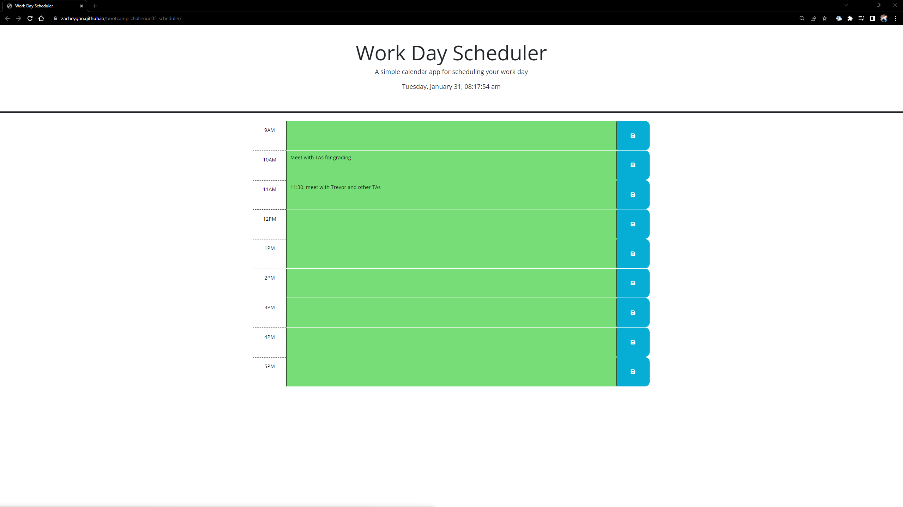
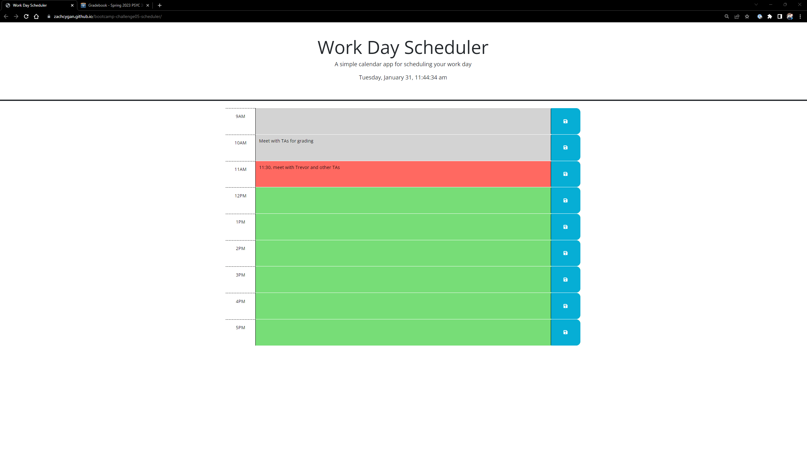

# <bootcamp-challenge04-Javascript-Quiz>

## Description

My motivation for this project is to make a scheduler to keep track of your daily objectives. It features color identifcation to represent the past, present, and future to easily determine what is coming up sooner.  

## Installation

The webpage is available at https://zachcygan.github.io/bootcamp-challenge05-scheduler/. To view the source code within your browser, press F12 or right click the webpage and select "inspect" on windows. For MacOS,  press Command+Option+I or fn F12 (MacOS) to open Chrome DevTools. You can view any elements on the webpage or any of the styling by selecting the corresponding section in Chrome DevTools. 

## Instructions

To add events to a time slot, simple tap or click into the block and type the event. But make sure to click the save button on the right side to save your entry. To overwrite an event, simply delete the old text and save your new entry. 

### Colors
Green: future  
red: current  
grey: past

## Screenshots

